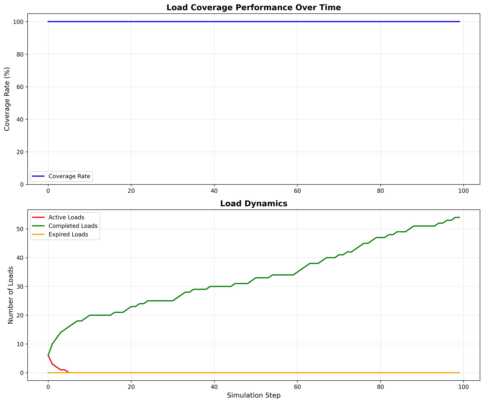
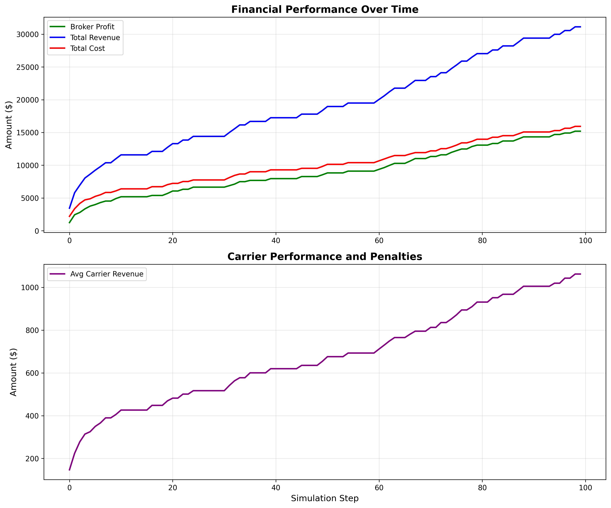
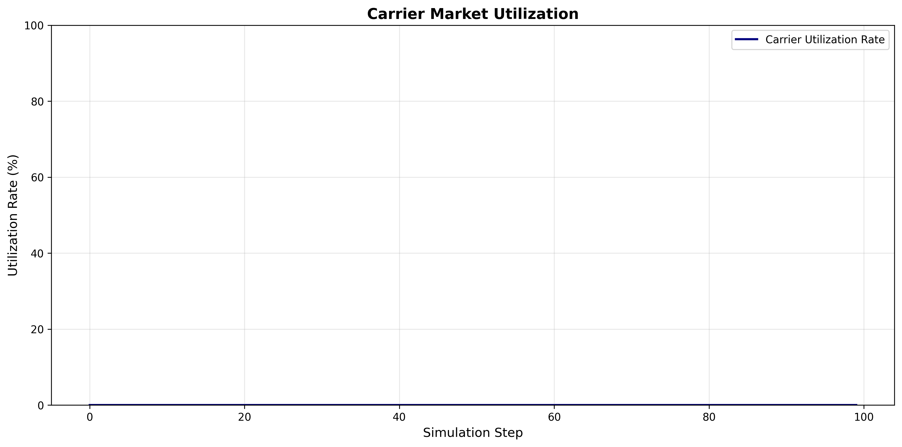
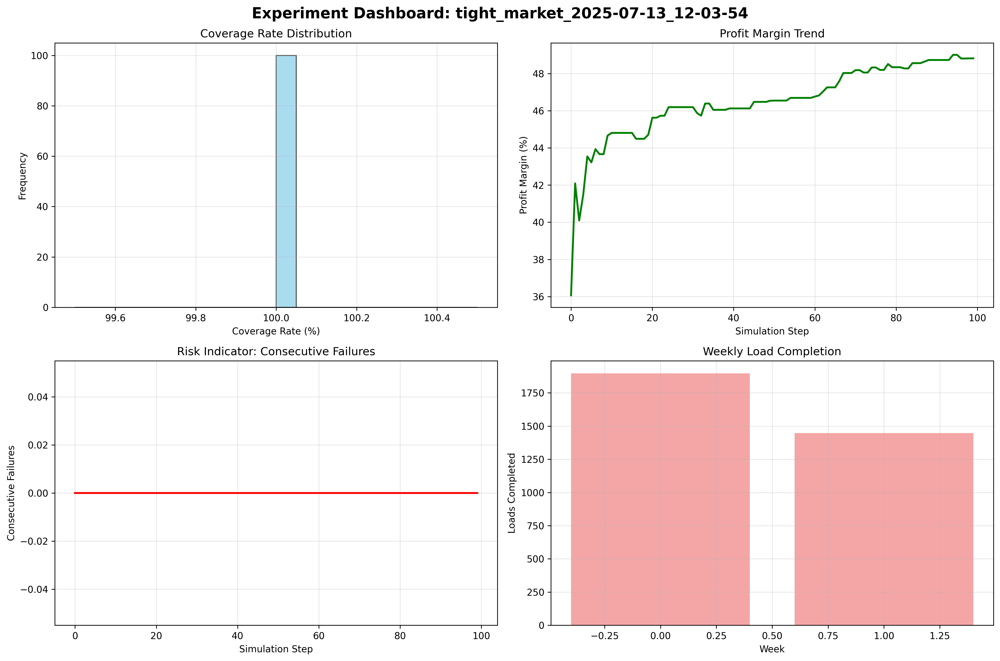

# Freight Brokerage ABM Experiment Report

**Experiment:** tight_market_2025-07-13_12-03-54  
**Scenario:** tight_market  
**Generated:** 2025-07-13 12:03:55  

## Configuration

- **Carriers:** 15
- **Grid Size:** 100x100
- **Load Generation Rate:** 0.5 per step
- **Market Volatility:** ±20.0%
- **Broker Patience:** 0.8
- **Max Negotiation Rounds:** 3
- **Penalty Rate:** 20.0%

## Performance Summary

| Metric | Value |
|--------|-------|
| Coverage Rate | 100.0% |
| Total Loads Covered | 54 |
| Total Loads Expired | 0 |
| Broker Profit | $15,195 |
| Total Revenue | $31,129 |
| Avg Carrier Revenue | $1,062 |
| Consecutive Failures | 0 |

## Market Analysis

- **Average Carrier Utilization:** 0.0%
- **Average Profit Margin:** 46.5%
- **Total Load Volume:** 54 loads

## Performance Trends (Final Quarter)

- **Average Coverage Rate:** 100.0%
- **Profit Growth Rate:** $118.92 per step
- **Carrier Revenue Growth:** $7.64 per step

## Visualizations

### Load Dynamics

### Financial Performance

### Market Utilization

### Performance Dashboard

## Generated Files

- `config.yaml` - Configuration used for this experiment
- `summary.json` - Detailed metrics in JSON format
- `timeseries_data.csv` - Complete time series data
- `plots/` - Directory containing all visualization plots
- `report.md` - This human-readable report
